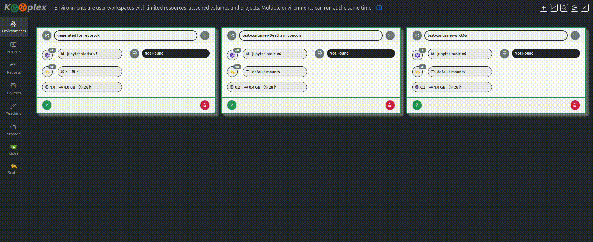
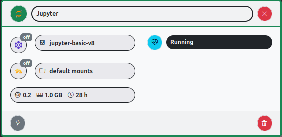
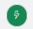
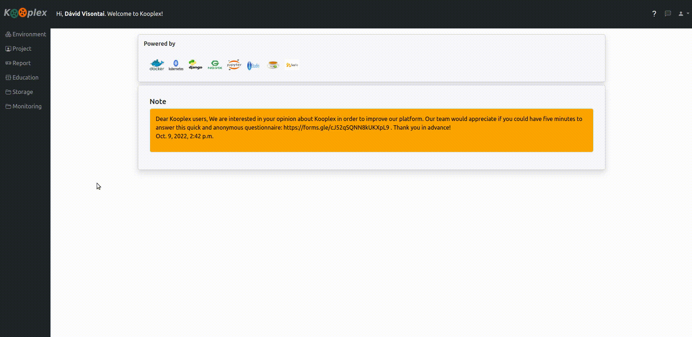

# Environments
## Create an environment
Add a name and select an image

## Configure the environment

    
---

**Explanation for the panel buttons:**

*   
    * Open Jupyter/Rstudio etc, 
    * The name of the environment
    * Stop the environment

*   
    * Enable [Teleport](services/teleport.md) (for remote access with e.g. vscode)
    * Image type of the environment
    * Logs of the running environment
    * Status of the running environment

*   
    * Enable [Seafile](services/seafile.md) cloud storae to be mounted into the environment
    * List and count of mounted (projects/volumes/courses)

*   
    * Limit of available resources: CPU, Memory and allowed idle timelength

*     
    * Launch the environment
    * Delete permanently the environment 

In case of any problems with the *environment* the given *message* on the panel or in the logs might help to resolve the conflict, or should be reported to the site administrators when asking for help.
When it is **stopped** the container ceases to exist, but the files are kept that are in any of the [permanent storage spaces](folderstructure.md)

## Configure an environment 
* Name/Image/Resources
* Projects
* Courses
* Attachments
* Volumes

For example add a volume to an existing environment

## Select an Image
One can choose a suitable working environment by choosing the right image.

> Docker images are the basis of containers. An Image is a template for virtualized/containerized working environments. Most of the necessary packages and utiities are installed into the images. [Read more](https://docs.docker.com/engine/reference/commandline/images/)

## Computational Resources
* **Node**: If permitted, then select a server for the environment
* **CPU/Memory**: If needed for computational or memory intensive calculations the container resources can be increased. Please mind that containers reserve these resources as long as they are running and no other container can use it.
* **GPU**: In case any nodes have GPU cards. 

## Package management within environments

* See [Package management](packagemanagement.md)
* Some conda environments and non-conda tools might be installed into attachments -> See [Volumes, Storage](folderstructure.md)
