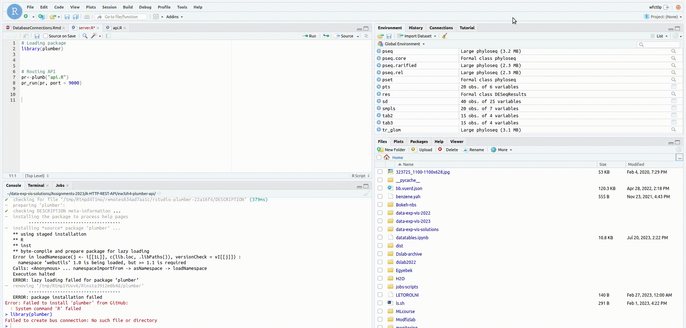

--> For studio scroll down <a href="#rstudio"> here</a> for a more detailed explanation

# Root folder is `/v` 
This folder is read-only and everything is mounted into this one. 
We have the following folders in `/v/`:

### Private folders
  - `<username>/` - a users own, private/home folder
  - `garbage/` - automatically archived content (e.g. when a project is deleted)

### Project related folders
Any number of [projects](projects.md) can be attached to each *environment*, and also a project an be associated with any number of *environments*. For each project a folder will appear in the `projects/` folder and in the `report_prepare/` folder for related reports.

  - `projects/` - multiple [projects](projects.md) can be mounted to an environment. Share data with collaborators
  - `report_prepare/` - a folder for each project to place all files and data for a report. See [reports](reports.md)
  
### Storage folders
*Volumes* are large and/or read-only, already existing datasets and *attachments* are user created storage spaces for smaller datasets, applications etc. for sharing it between *projects* *reports*. These storages can be attached to the *environments* and each will appear under 

  - `volumes/` - read-only datasets and storagefor publicly shared data, programs, config files etc
  and
  - `attachments/` - storage for publicly shared data, programs, config files etc
  folders.

### Course folders
Any number of [courses](education.md) can be set for each *environment*, and also a c*course* can be associated with any number of *environments*. For each *course* the relevant folders will appear in the `courses/` folder.

- `courses/` - several folders for each course
	- `<course_name>.assignment_prepare/` - Put the content of a future assignment into a separate folder. It will be selectable from the *Education menu* -> *Assignment management* -> *New assignment* tab (for Teacher's only, [See how to add new assignment](education.md))
  
 	- `<course_name>.assignments/` - All students' assignment (working) folder is placed here. At submission a snapshot will be created from these folders and it will be copied to the teachers' correct folder after submission. 
  - `<course_name>.correct/` - Submitted assignments appear here for corrections (for Teacher's only)
  - `<course_name>.public/` - All members of the course can see and edit the contents here
 
 

### Further private folders
  - `scratch/` - temporary storage (e.g. for large calculations)
  - `cloud/` - selected folders from [Seafile](services/seafile.md) (if any folder is mounted to the environment)
  - `vc/` - [version controlled repositories](services/gitea.md) (if any repository is added to the environment)

### Seafile (cloud base file sharing) 
You can add folders from the Seafile cloud based file storing and sharing platform. 
Read more about [file synchronization](services/seafile.md)

### Repository from the Gitea (version controlled content)  
Repositories can be added from Gitea/Github etc. Read more about [repository adding](services/gitea.md)

-----

## Access folders in Rstudio

To access all folders you need to go to `/v`: 

