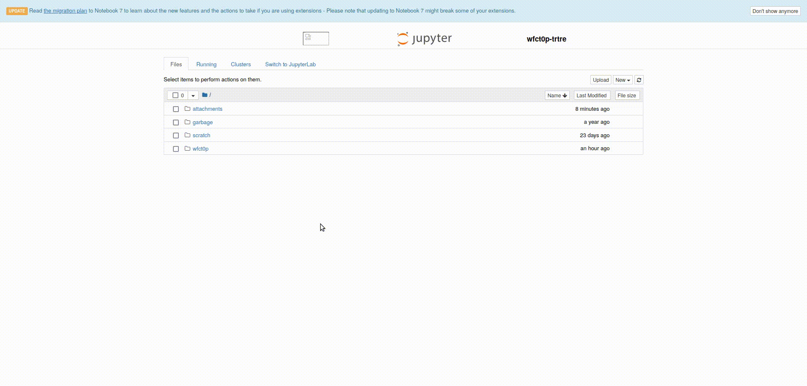

# Package and Project management for Python

The Python packaging ecosystem has evolved from a fragmented set of manual tools into a sophisticated landscape of "all-in-one" managers. The primary goal of these tools is to solve the "it works on my machine" problem by ensuring that every developer (and production server) uses the exact same Python version and library versions.

While **pyenv** and **Poetry** represent the "modular" era—where you pick one tool for the Python version and another for the libraries—**Conda** and **uv** represent the "unified" era, where a single tool handles the entire stack.

---

## 1. Conda: The Heavyweight Multi-Language Manager
Jump to <a href="#withconda"> usage --></a>

**Significance:** it manages binaries for C++, R, and GPU drivers (like CUDA). It is the gold standard for **Data Science** and **Machine Learning** where non-Python system dependencies are common.


 * **Similarity:** Like the others, it creates isolated environments.
 * **Difference:** It installs pre-compiled binaries from its own "channels" (like Conda-Forge) rather than just PyPI, allowing it to manage complex system-level libraries that pip cannot.


## 2. uv: The Modern Speed Demon
Jump to <a href="#uv"> usage --></a>

**Significance:** Written in Rust, **uv** is designed to be "unreasonably fast"—often 10–100x faster than pip. It is a unified tool that effectively replaces pyenv, pip, and Poetry in one go.

* **Similarity:** It handles Python versions (like pyenv), dependencies (like Poetry), and virtual environments.
* **Difference:** Its performance is unmatched. While Poetry can be slow at "resolving" which versions of libraries work together, uv performs this logic in milliseconds.

### 3. pyenv: The Dedicated Version Switcher
Jump to <a href="#pyenv"> usage --></a>

**Significance:** Pyenv follows the Unix philosophy of "doing one thing well." Its only job is to install and switch between different versions of the Python interpreter itself (e.g., switching from Python 3.9 to 3.12).

* **Similarity:** It shares the goal of environment isolation but only at the "global" or "interpreter" level.
* **Difference:** It does **not** manage your libraries (numpy, pandas, etc.). You almost always use it in tandem with another tool like Poetry or Pip.

### 4. Poetry: The Structured Architect
Jump to <a href="#poetry"> usage --></a>

**Significance:** Poetry revolutionized Python development by introducing a deterministic "lockfile" (`poetry.lock`). It focuses on the **Project Life Cycle**, handling everything from dependency resolution to building and publishing your code to PyPI.

* **Similarity:** Like Conda and uv, it manages virtual environments and library dependencies.
* **Difference:** It uses the `pyproject.toml` standard to define project metadata and is designed primarily for developers building shareable packages or libraries.

---

## Quick Comparison Table

| Feature | Conda | pyenv | Poetry | uv |
| :--- | :--- | :--- | :--- | :--- |
| **Primary Goal** | Data Science / Multi-language | Managing Python versions | Project & Dependency Mgmt | Fast, All-in-one Mgmt |
| **Written In** | Python / C | Shell / C | Python | **Rust** |
| **Manages Python?** | Yes | **Yes (Primary focus)** | Partially | Yes |
| **Manages Packages?**| Yes (Conda-Forge) | No | Yes (PyPI) | Yes (PyPI) |
| **Best For** | Heavy ML / GPU / Science | General version switching | Application / Library devs | High-performance workflows |
| **Lockfile** | `environment.yml` | N/A | `poetry.lock` | `uv.lock` |


<div id="withconda"></div>

### Usage of Conda
``` bash
> conda create -y --name new_env # Create the nw environment
> . /opt/conda/bin/activate # Activate it
> conda activate new_env
> conda install -y python=3.10 # Install python interpreter

# Install packages
> conda install -y -c conda-forge --force cudnn cudatoolkit=11.8.0` 
> conda install -y pip ipykernel # Install ipykernel if you want to use it in notebooks
> pip install nvidia-cudnn-cu11==8.6.0.163
> pip install tensorflow==2.12
> ipython kernel install --user --name=new-env - this is needed only if you install it to path, where jupyter is not seeing it.
```

### Use a `conda` environment
Before activating a conda environment type:
``` bash
> . /opt/conda/bin/activate
```

#### Method 1. `conda activate <env_name>`
	
  * for a locally created conda environment - with `conda create -n <env_name>` that resides in `~/.conda/envs/<env_name>`
	
  * or a conda environment that comes with the image 
  
For example
```
> . /opt/conda/bin/activate
> conda activate tensorflow
```

#### Method 2. `conda activate <path_to_env>`
* for a conda environment created into folder or attachment - for example with the command 'conda create -p /v/attachments/<attachment_name>'

Then type
```
> ipython kernel install --user --name=tensorflow
```
The 'kernel install command' is needed only once. This will install the kernel into userspace (into `/v/$NB_USER/.local/share/jupyter/kernels/tensorflow` user directory) and jupyter will be able to use it in the future.
E.g.
```
> . /opt/conda/bin/activate
> conda activate /v/attachments/tensorflow/
> ipython kernel install --user --name=tensorflow
```

List available kernels to check whether it worked
```
jupyter-kernelspec list
```




<div id="uv"> </div>

### Usage of UV
An extremely fast Python package installer and resolver, written in Rust
Read about `uv` here:

* [https://docs.astral.sh/uv/](https://docs.astral.sh/uv/guides/)
* [https://astral.sh/blog/uv](https://astral.sh/blog/uv)
* [https://github.com/astral-sh/uv](https://github.com/astral-sh/uv)

Maybe the simplest and most useful way to get started with uv and assure reproducibility is to create a project [https://docs.astral.sh/uv/guides/projects/](https://docs.astral.sh/uv/guides/projects/):
```
mkdir hello-world
cd hello-world
uv init
```
uv will create the following files:
```
├── .gitignore
├── .python-version
├── README.md
├── main.py
└── pyproject.toml
```
The main.py file contains a simple "Hello world" program. Try it out with uv run:
```
uv run main.py
```

Then you can install packages
```
uv add sqlalchemy pandas
```
or
```
uv pip install  sqlalchemy pandas
```

For further details on usage consult with the official [documentation](https://docs.astral.sh/uv/guides/projects/)

<div id="poetry"> </div>

### Usage of Poetry
Poetry-kernel is installed to v8 images, therefore it is possible to use poetry environments in notebooks.
Visit https://python-poetry.org/ for documentation.

<div id="pyenv"> </div>

### Usage of Pyenv
witch between Python versions

To select a Pyenv-installed Python as the version to use, run one of the following commands:
```
pyenv shell <version> -- select just for current shell session
pyenv local <version> -- automatically select whenever you are in the current directory (or its subdirectories)
pyenv global <version> -- select globally for your user account
```
E.g. to select the above-mentioned newly-installed Python 3.10.4 as your preferred version to use: 
``` 
pyenv global 3.10.4
```

Now whenever you invoke python, pip etc., an executable from the Pyenv-provided 3.10.4 installation will be run instead of the system Python.

Using "system" as a version name would reset the selection to your system-provided Python.

### non-Python applications
Using the right image, one might be able to install or compile applications into an attachement or volume, which can be mounted to any other environment.