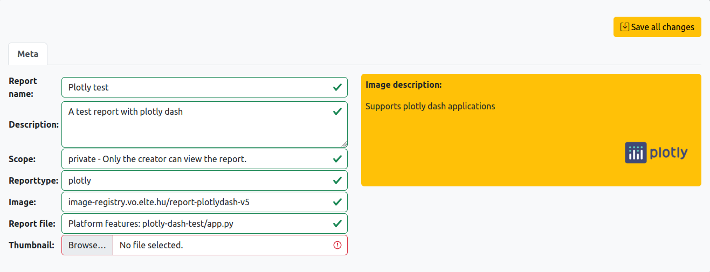
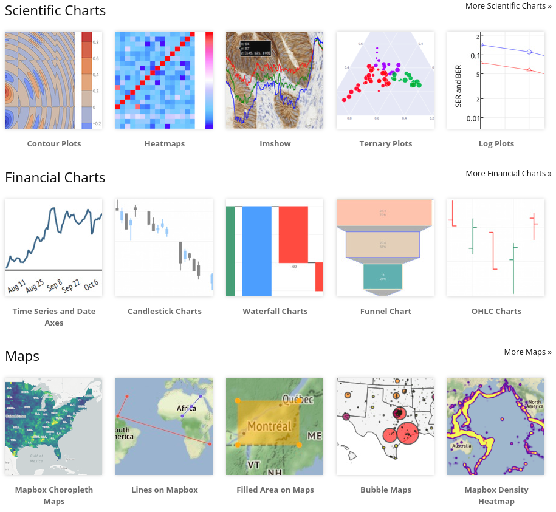
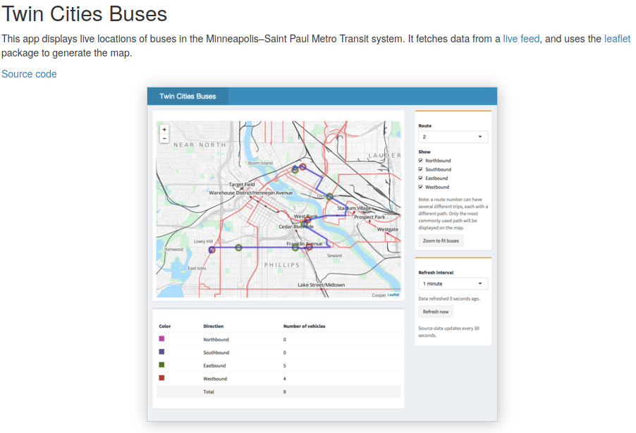

# Prepare your reports 

## From local files
A report or application usually consist of several files and folders in order to contain

* the necessary code for creating it
* the data that needs to be visualized
* and the environment, necessary packages on which the code depends
* an executable startup file 'start.sh' that contains the command to run the code

Place these files into separate folders: `report_prepare/<project_name>`. The `New Report` form will pick up these folders.


## From repositories
It is also possible to upload a token for a version control system (e.g. github, gitea) and then repositories can be selected from the given accounts.

# Quickstart for creating a report:




# Report types

* **Static**: anything that is converted into html can be served as a *static* html
or 
* **Interactive html**: a server is running in the backend, which processes commands coming from the user interface and therefore it can access all kind of resources to dynamically change figures in the report

An *url* is provided for each report at which it can be visited in the browser. In case of APIs the same url van be used for access.

## Plotly dash
Here is an [example code](static/plotly-dash-app-example.py)

The important steps are to use the proper environmental variables when creating the *Dash* instance and the *server* object
```
REPORT_URL = os.getenv("REPORT_URL")
app = Dash(__name__, url_base_pathname="/"+REPORT_URL)

REPORT_PORT = os.getenv("REPORT_PORT")
HOSTNAME = os.getenv("HOSTNAME")
app.run_server(debug=False, port=REPORT_PORT, host=HOSTNAME)
```
Example plotly plots and dashboards: 

## R shiny dashboards
The server will look for an **app.R** or **ui.R**.

Here are some [shiny examples](https://rstudio.github.io/shinydashboard/examples.html) and a [tutorial](https://shiny.rstudio.com/tutorial/).
Example shiny dashboard: 


## Bokeh server
The image runs automatically the following command:
```
/opt/conda/bin/bokeh serve  $REPORT_FOLDER --prefix ${REPORT_URL} --allow-websocket-origin k8plex-test.vo.elte.hu --port $REPORT_PORT 
```
It will look for a **main.py** or **main.ipynb** file


# Images for reports
For extra python packages a `requirements.txt` needs to be placed in the report's folder.<br>
Upon request a more customized image can be built with the necessary system packages.

## Applications and REST services
Application can be served adn APIs as well.