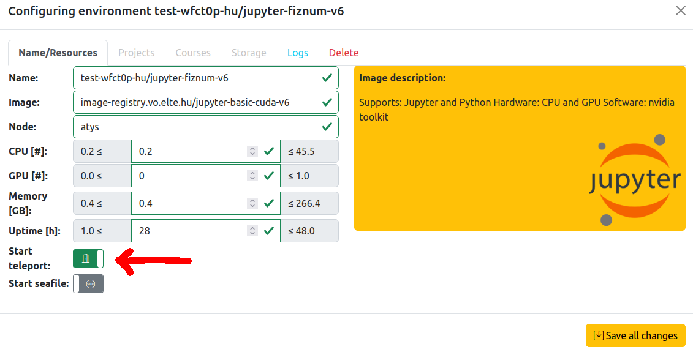

### Environment setting



#### Install
Teleport lets you login with a two-factor authentication, so you will need to setup an authenticator, such as this: <br>

  https://play.google.com/store/apps/details?id=com.authy.authy&hl=en_US&gl=US&pli=1

You will need the tsh command (version 14.\*), that can be obtained here for [linux](https://cdn.teleport.dev/teleport_14.3.31_amd64.deb) and (windows)[https://cdn.teleport.dev/Teleport%20Connect%20Setup-14.3.31.exe]

#### Registration
Upon request the administrators will send you a link similar to this `https://teleport.vo.elte.hu:443/web/invite/` with which you can register, activate your account and setup Two Factor Authentication. 
It is valid for 60 minutes!

#### Login and connect
You may login with the following command (https://goteleport.com/docs/connect-your-client/tsh/)
```bash
tsh login --proxy=teleport.vo.elte.hu --user=<username> [--ttl 1200]
```
If any of your container is running on Kooplex, then 
```bash
tsh ls
Node Name   Address             Labels          
----------- ------------------- --------------- 
wfct0p-jupy 172.18.204.48:40109 teleport=wfct0p 
```
should list it. Then you will be able to login with
```bash
tsh ssh <username>@<node_name>
```

> Note that the `--ttl N` flag sets the validity of the certificate, so the larger the `N` is the later will you need to login again
{.is-info}


#### How to setup ssh connection without tsh
`tsh login` is still necessary as it sets up all the connections between the teleport server and the clients. This time we need a configuration of the infrastructure that is read by ssh. Type `tsh config` and copy it's content into your ssh config file (e.g. `~/.ssh/config`.

List the available pods that are accessible for your user account:
```
$ tsh ls
Node Name   Address             Labels          
----------- ------------------- --------------- 
wfct0p-jupy 172.18.204.48:40109 teleport=wfct0p 
```
Then we will need the address and the port substituted into this [form](https://goteleport.com/docs/server-access/guides/openssh/openssh/):

```bash
ssh -p ${PORT}  "${USER}@${ADDR}.${CLUSTER}"
# where CLUSTER is teleport.vo.elte.hu
# therefore it will be
ssh -p 40109 wfct0p@172.18.204.48.teleport.vo.elte.hu
```

`rsync`, `scp` and other applications based on ssh will work as well

## How to setup ssh connection for Vscode
https://goteleport.com/docs/server-access/guides/vscode/

### Edit and run notebooks in Kooplex environments
When the plugin for remote connections is installed to VScode it will list you all the entries in your ssh config files or you can set the configuration file yourself.

<div id=vscode_remote></div>

### Using kernel from Kooplex environments
Select an existing kernel and enter an url that can be found at Environment Settings->Connections tab.


## Troubleshooting
[troubleshooting](/kooplex-manual/troubleshooting)